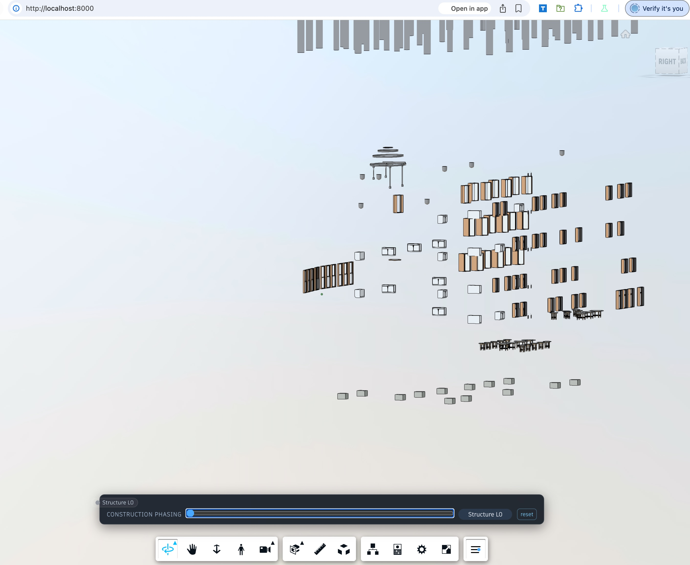
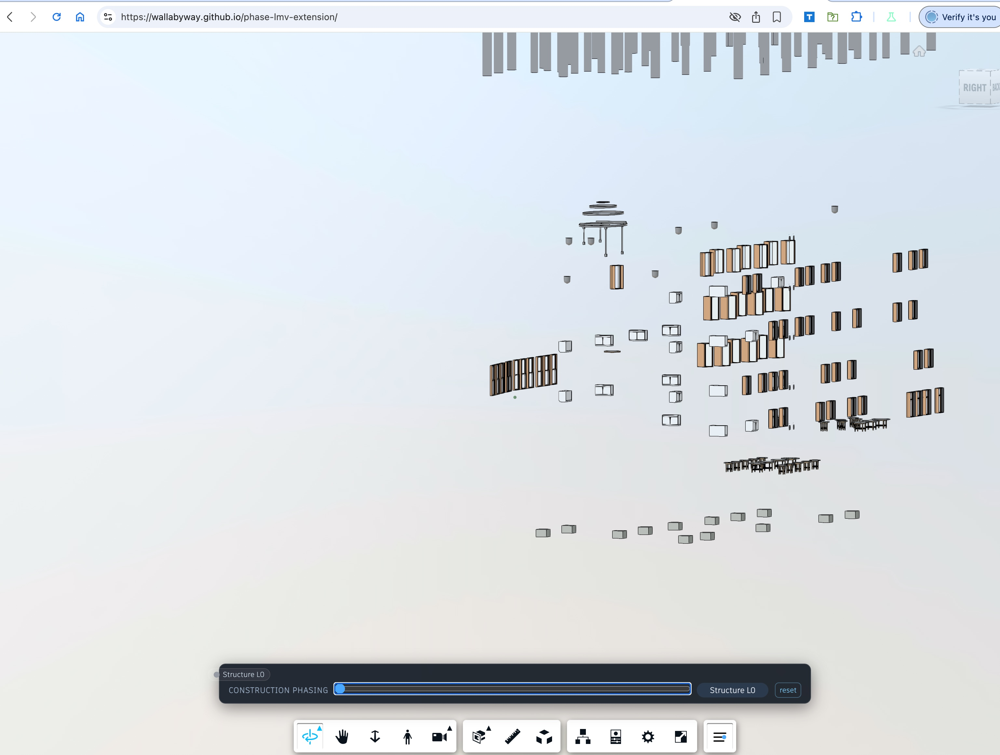

# Snowdon Tower — LMV Construction Phasing

A minimal Autodesk LMV viewer that loads **Snowdon-Tower-(Complete).rvt** and lets
you scrub a construction timeline: elements are hidden until their phase starts,
highlighted while in progress, and dimmed once finished.


## Run

Serve the folder (the viewer SDK needs http):

```bash
cd phase-lmv-ext
python3 -m http.server 8000
# open http://localhost:8000
```

Click the **phasing toolbar button** (timeline icon) to reveal the slider, then drag.
The bar sits on a single line above the viewer's bottom navigation toolbar.

## Files

| File | Purpose |
|---|---|
| `index.html` | Viewer container + phasing bar UI + inline LMV bootstrap (model URN, viewer startup) |
| `ext/ui.mjs` | `PhasingExtension`: toolbar button, slider bar, tooltip chip, embedded phase data (ES module) |
| `ext/phasing.mjs` | `PhasingEngine`: level detection, phase construction, hide/theming, fall-in animation via `fragList.updateAnimTransform` (ES module) |
| `tests/smoke-test.js` | Headless (Puppeteer) end-to-end test — load, toggle bar, scrub slider, probe visibility + theming (screenshots land in `tests/`) |
| `tests/plan.md` | Build plan / source materials |

## How it works

The app loads **Snowdon-Tower-(Complete).rvt** — a single combined `{3D}` view
containing every Revit category. Each element is bucketed by its per-element
**Category** property; categories that aren't Floors/Walls/Stairs/Roofs/
Lighting Fixtures (doors, furniture, MEP, …) join an **Other** phase at the end
of the timeline.

Phases follow a **real build sequence**: Structure rises floor by floor
(framing, columns, foundations, rebar), then Floors, Walls, Envelope
(curtain walls, mullions, windows), Stairs, and Doors — each dropping
L0 → L5 — followed by whole-building bursts: Roof, MEP, Finishes & FF&E,
Site & Landscape, and an **Other** catch-all (lines, space separation, …).
Each element's level comes from its Revit constraints (`Base Constraint` /
`Base Level` / `Level`); elements without level info are placed by height,
assuming the levels are evenly spaced over the model. Roof-level elements
(R1/R2/Parapet/…) join the Roof phase. Revit sub-categories (Runs, Supports,
Curtain Wall Mullions, Slab Edges, …) are mapped onto their construction
parent, and empty phases are pruned so the belt has no dead slots.

The timeline is a **conveyor belt**: a new part appears every `step` units
and stays in flight for `overlap` steps (default 2), so two parts hang and
fall at the same time while earlier parts rest dimmed on the floor. The last
part lands exactly at `t = 100`.

For a slider position `t`:

- `t < phase.start` → hidden
- `phase.start <= t < phase.end` → visible, phase color, **hanging above and
  falling into place** as t grows (fragment transform via
  `fragList.updateAnimTransform`; the 0..1000 slider drives the drop height
  directly along an **ease-out (cubic)** curve — no tweening)
- `t >= phase.end` → visible, dimmed phase color

A tooltip chip above the slider thumb follows the dragger and shows the
newest part to appear on the belt. The schedule (`DEFAULT_PHASES` in
`ext/ui.mjs`) is embedded in the app, so no external config fetch is needed.

## Smoke test

```bash
cd phase-lmv-ext
npm install                                          # local puppeteer + pngjs
node tests/smoke-test.js                             # needs Chromium at /Applications/Chromium-arm64.app
```

Loads the app headless, waits for phase analysis on the combined model, toggles
the bar, scrubs the slider through every phase, probes `isNodeVisible` + stored
theming colors per category, captures a t=0 screenshot, and asserts pixel
coverage stays low enough that furniture/windows are not drawn.

## Known issue — everything visible at t=0

**Symptom:** with the bar open at t=0 (label "Structure L0"), furniture and
windows are still visible — elements that should stay hidden until their phase
on the belt.

**User screenshots (local):**

```
/Users/bealem/Documents/SCR-20260818-nims.jpeg
/Users/bealem/Documents/SCR-20260818-njux.jpeg
```

Tracked copies (so the issue is visible from the repo):




**Status:** **Fixed.**

The root cause was LMV ≥ 7.119's new "Large Model Experience" (HLOD / out-of-core
tile manager). With HLOD enabled, geometry streaming stalled when the viewer was
driven manually, so `GEOMETRY_LOADED_EVENT` never fired and the phasing render
never got applied — leaving the whole model, including furniture and windows,
visible at t=0.

Fixes applied:

- Disable `LARGE_MODEL_EXPERIENCE` via `FeatureFlags._setInitializationData`
  before `Autodesk.Viewing.Initializer` runs (`index.html`).
- `render()` now uses `viewer.isolate()` per model with the exact set of dbIds
  that should be visible at the current slider position. This is the renderer's
  own visibility source-of-truth and avoids the SVF2 visibility-manager race
  that could leave hidden fragments drawn.
- `update()` re-applies `viewer.isolate()` on every slider input (not only when
  the phase status key changes), so scrubbing forward to later phases and then
  back to t=0 cannot leak hidden geometry.
- `clearOverrides()` exits isolation mode with `viewer.showAll()` when phasing is
  deactivated.
- Hidden phases have their theming color cleared (no stale color overrides on
  hidden fragments).
- Module imports are cache-busted (`?v=5`) and `index.html` carries no-cache
  meta tags so browsers cannot load a pre-fix build.

Verification:

- `tests/smoke-test.js` now asserts pixel coverage at t=0 stays below 25% (with
  the bug it was ~67%).
- Fragment-level scan at t=0 shows only the first phase's fragments visible.
- The smoke test scrubs to t=100, t=300, and back to t=0 and asserts no hidden
  phases leak after the scrub.
- Running the smoke test produces `tests/smoke-t0.png` (and optionally
  `tests/nonheadless-t0.png`) confirming only Structure L0 geometry is drawn.
